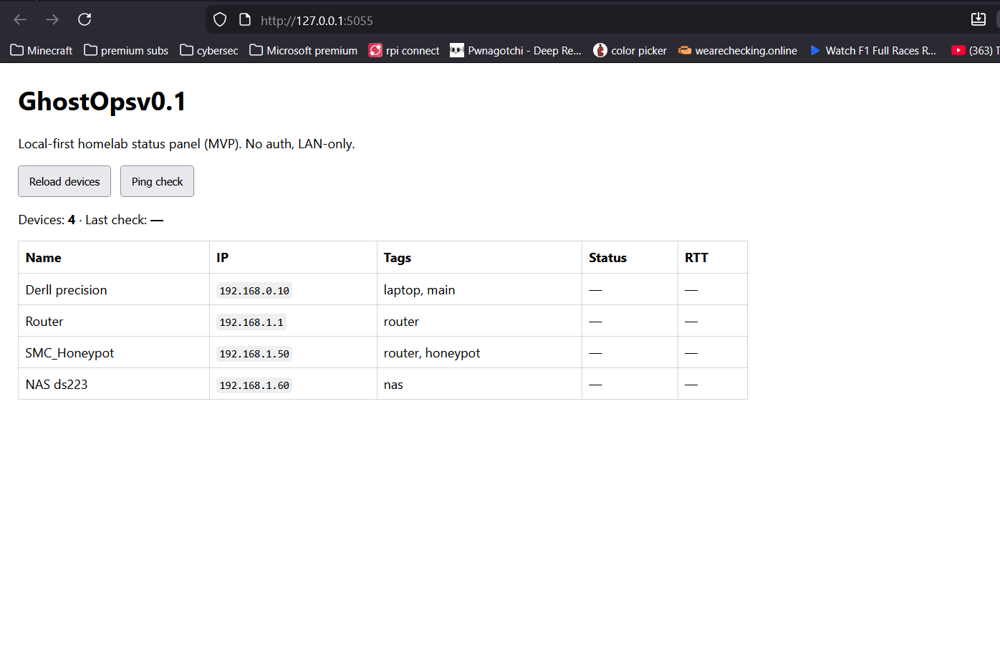

## GhostOps v0.1

GhostOps is a local-first homelab status panel designed to give fast visibility into devices on my LAN. The initial v0.1 release focuses on device inventory and reachability checks without requiring any external services

### Features
- Device inventory loaded from JSON
- Cross-Platform ping checks for getting the device status (UP/DOWN) and latency
- Simple LAN-accesible web UI
- Live status refresh and RTT measurement

### Demo
